# 🚀 Deploying a PrestaShop E-commerce Application on AWS Using Amazon EC2, Nginx, PHP-FPM, and Amazon RDS

## 📌 Project Overview

This project demonstrates the deployment of a **PrestaShop e-commerce application** on **Amazon Web Services (AWS)** using:

- Amazon EC2 (Ubuntu)
- Nginx Web Server
- PHP 8.5 & PHP-FPM
- Amazon RDS (MySQL)
- SSH for remote administration

The objective was to deploy a production-style cloud infrastructure where the web application runs on an EC2 instance while the database is hosted separately on Amazon RDS. The deployment was completed successfully, with the PrestaShop Front Office and Back Office accessible through the EC2 instance and all application data stored in Amazon RDS.

---

## Table of Contents

- [AWS Region](#aws-region)
- [Architecture](#architecture)
- [Technologies Used](#technologies-used)
- [Prerequisites](#prerequisites)
- [Project Workflow](#project-workflow)
- [Key Commands Used](#key-commands-used)
- [Screenshots](#screenshots)
- [Verification](#verification)
- [Security Configuration](#security-configuration)
- [Challenges Encountered](#challenges-encountered)
- [Lessons Learned](#lessons-learned)
- [Author](#author)

---

## AWS Region

This project was deployed in the **AWS us-east-1** Region.

---

## Architecture

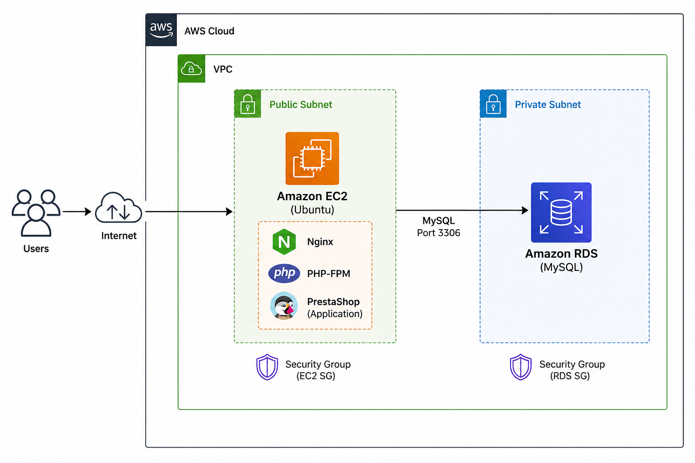

Users access the PrestaShop application through the EC2 instance running Nginx. PHP requests are processed by PHP-FPM, while all application data is stored in a separate Amazon RDS MySQL database. Separating the application server and database improves scalability simplifies database management, and follows AWS cloud architecture best practices.

---

## Technologies Used

- AWS EC2
- Amazon RDS MySQL
- Ubuntu Server
- Nginx
- PHP 8.5
- PHP-FPM
- MySQL Client
- SSH
- PrestaShop 9

---

## Prerequisites

- AWS Account
- Ubuntu EC2 Instance
- Amazon RDS MySQL Instance
- SSH Key Pair
- Security Groups configured
- VPC networking

---

## Project Workflow

1. Launch an Ubuntu EC2 instance.
2. Configure Security Groups.
3. Connect to EC2 using SSH.
4. Install Nginx.
5. Install PHP and PHP-FPM.
6. Create an Amazon RDS MySQL database.
7. Connect EC2 to RDS.
8. Upload PrestaShop.
9. Configure Nginx.
10. Complete the PrestaShop installation.
11. Troubleshoot routing and database connectivity.
12. Successfully access both the Front Office and Back Office.

---

## Key Commands Used

```bash
sudo apt update
sudo apt install nginx -y
sudo apt install php8.5-fpm php8.5-mysql -y
sudo systemctl enable nginx
sudo systemctl start nginx
sudo systemctl status nginx
php -v
```

---

## Screenshots

### 1. AWS Infrastructure

#### Amazon EC2 Instance

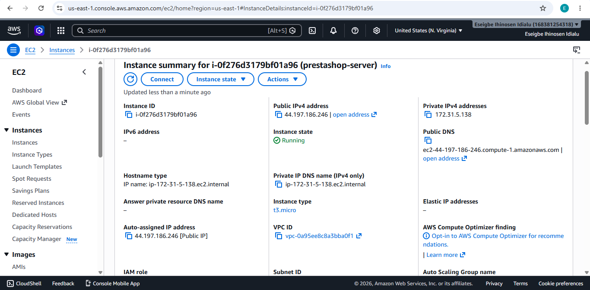

#### Amazon RDS Database

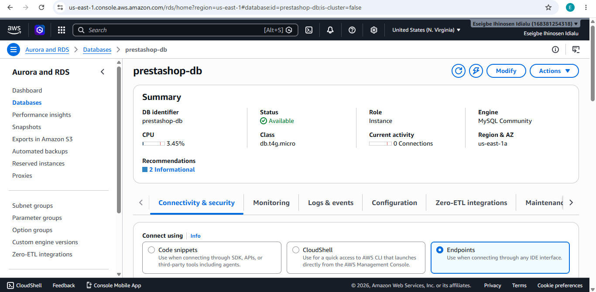
---

### 2. Server Setup (SSH, PHP & Nginx)

Connected to the EC2 instance via SSH and configured the web server.

#### SSH Connection

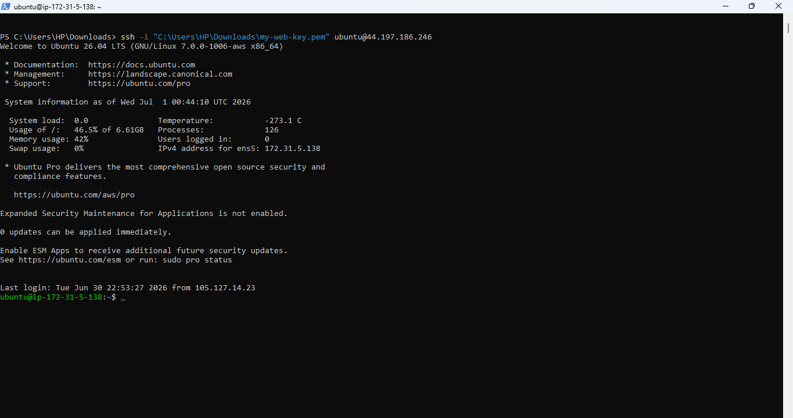

#### PHP Installation

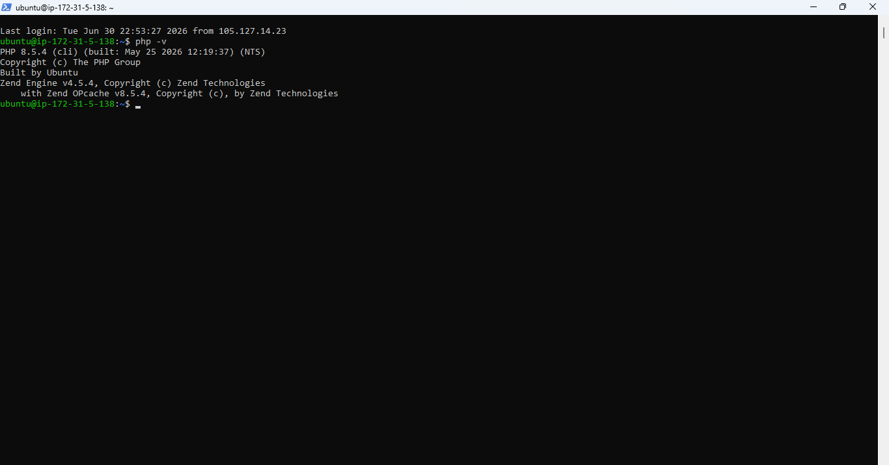

#### Nginx Running

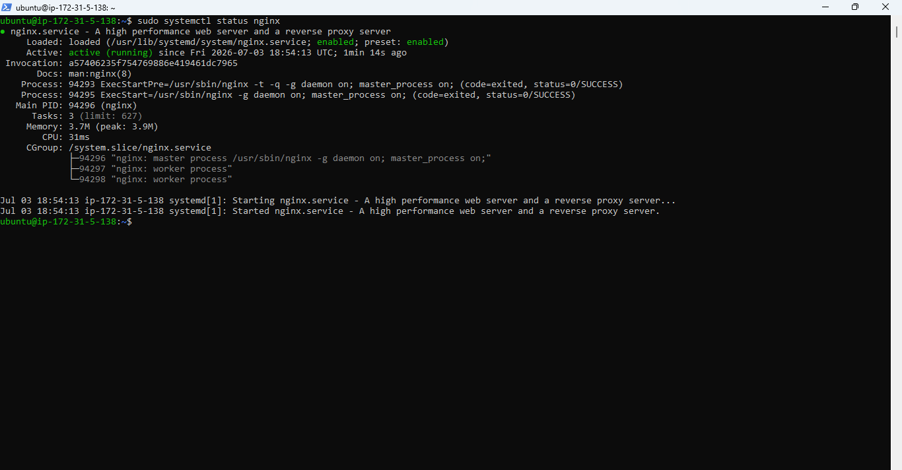

---

### 3. PrestaShop Installation

Completed the installation wizard and connected the application to Amazon RDS.

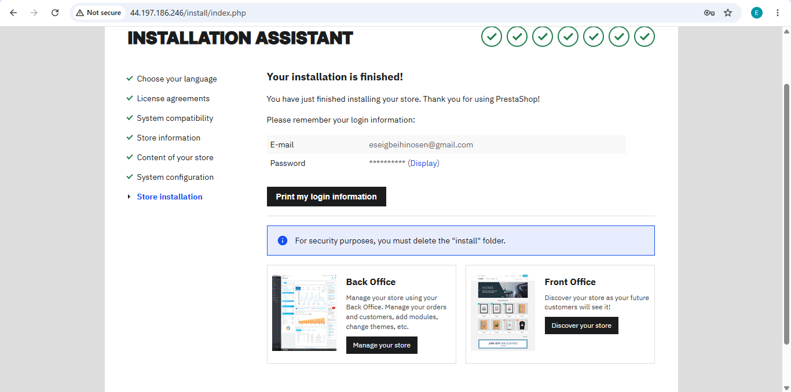

---

### 4. Front Office

Successfully loaded the PrestaShop storefront.

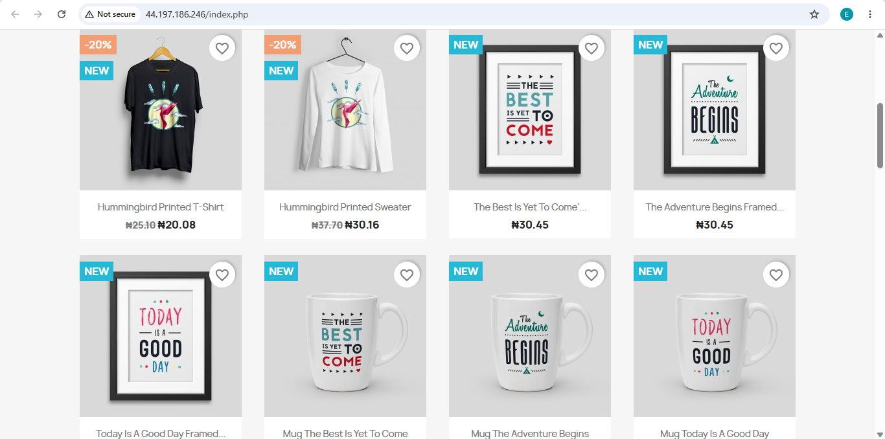

---

### 5. Back Office

Successfully logged into the PrestaShop Administration Dashboard.

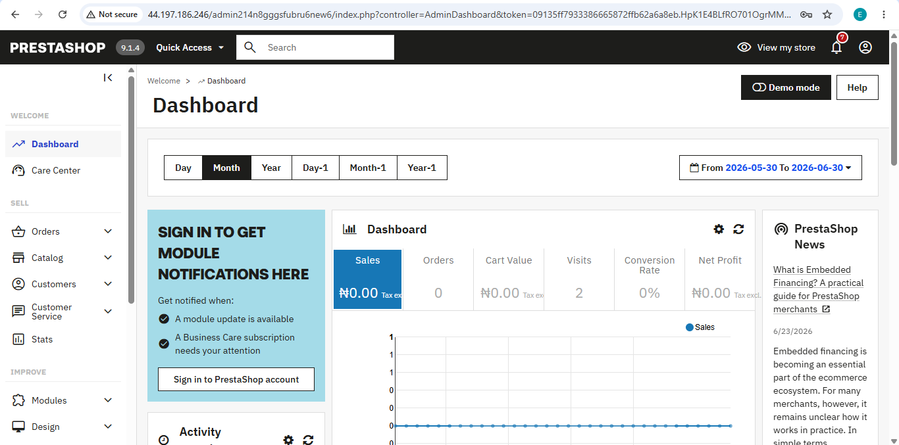

---

### 6. Database Connection (Amazon RDS)

The EC2 instance successfully connected to the Amazon RDS MySQL database. The screenshot below shows the PrestaShop database and its tables, confirming that the installation completed successfully and the application is using Amazon RDS as its backend database.

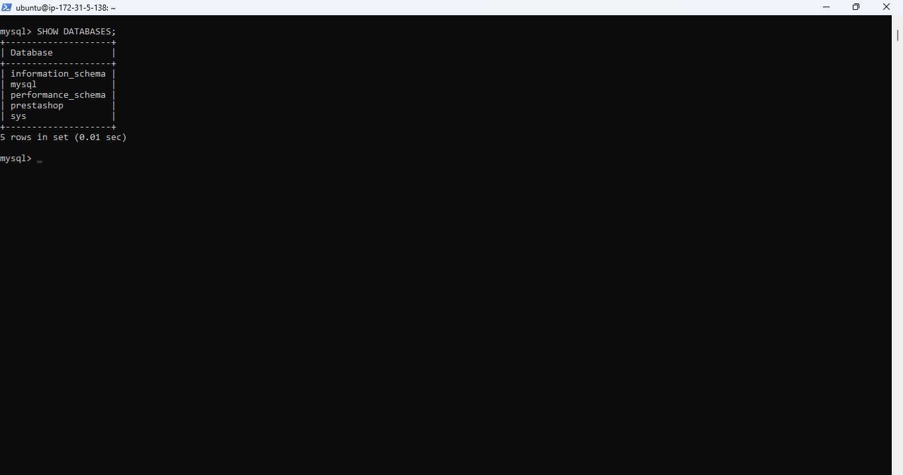

---

### 7. Nginx Configuration

The application uses PHP-FPM through Nginx.

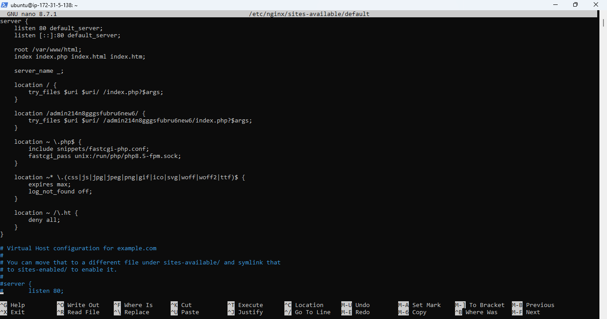

---

## Verification

The deployment was successfully verified by:

- Accessing the PrestaShop Front Office from a web browser.
- Logging into the PrestaShop Back Office using the administrator account.
- Confirming that the PrestaShop database and tables were created in Amazon RDS.
- Verifying that the Nginx and PHP-FPM services were running successfully on the EC2 instance.

---

## Security Configuration

### EC2 Security Group

- SSH (22) — Administrator access
- HTTP (80) — Public web traffic

### Amazon RDS Security Group

- MySQL (3306)
- Allowed only from the EC2 Security Group
- Database not publicly accessible

---

## Challenges Encountered

- PHP-FPM configuration
- Nginx routing
- Uploading PrestaShop to EC2
- Connecting Amazon RDS
- PrestaShop Back Office redirect issue
- Cache clearing and routing troubleshooting

---

## Lessons Learned

During this project I learned how to:

- Deploy applications on AWS EC2.
- Configure Nginx with PHP-FPM.
- Connect an application to Amazon RDS.
- Secure cloud resources using Security Groups.
- Troubleshoot application deployment issues.
- Deploy a production-style cloud architecture.

---

## Author

**Eseigbe Ihinosen**

Cloud Engineering Project

AWS • Linux • Nginx • PHP • Amazon RDS • PrestaShop